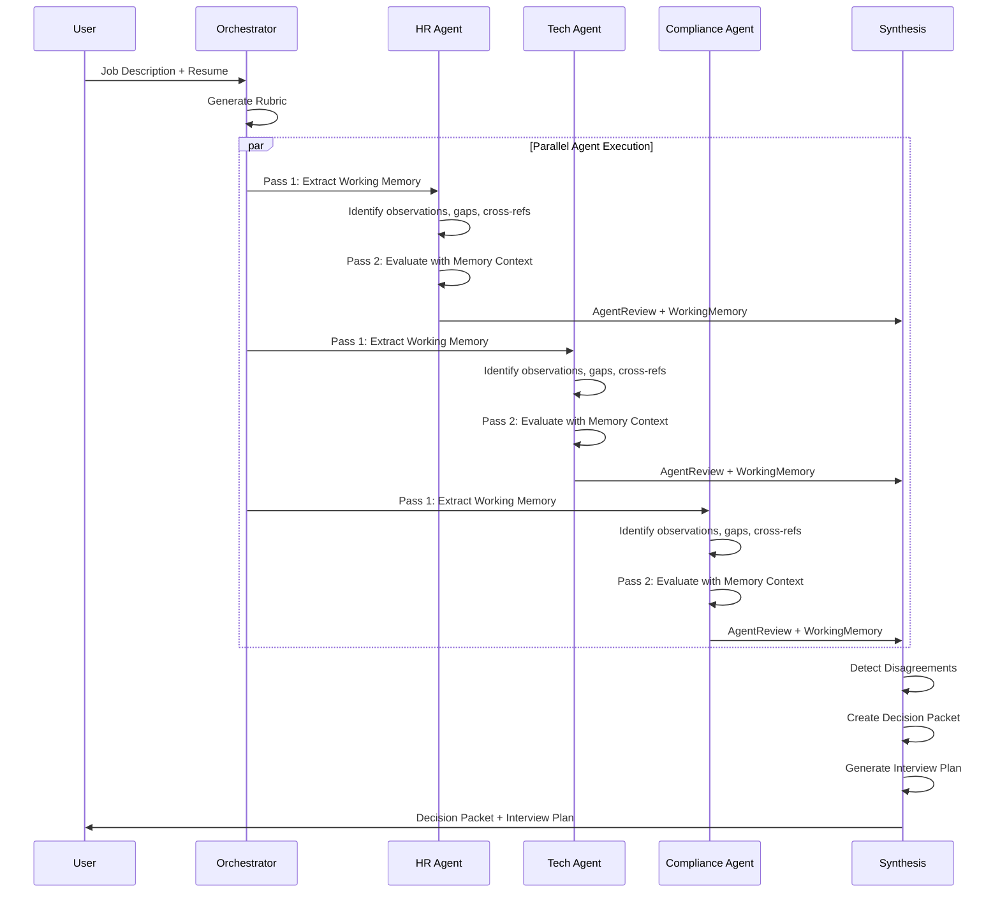

# Agentic Hiring Orchestrator

Multi-agent hiring evaluation system using LangGraph for structured, evidence-based candidate assessment.

## Overview

This project implements an intelligent hiring evaluation system that uses multiple specialized AI agents to assess candidates against structured rubrics. The system orchestrates HR, technical, and compliance agents to provide comprehensive, evidence-based evaluations with minimal human bias.

**Key Features:**
- **Multi-Agent Orchestration**: Specialized agents (HR, Technical, Compliance) work in parallel
- **Two-Pass Evaluation**: Agents extract working memory before scoring for better context
- **Evidence-Based Scoring**: All evaluations require citations from application materials
- **Structured Rubrics**: Automated rubric generation from job descriptions
- **Disagreement Detection**: Flags score discrepancies between agents for human review
- **Interview Planning**: Generates targeted interview questions based on evaluation gaps

## Project Structure

```
agentic-hiring-orchestrator/
├── backend/              # Python backend with LangGraph workflows
│   ├── src/             # Application source code
│   ├── tests/           # Test suite
│   ├── notebooks/       # Jupyter notebooks for development
│   ├── examples/        # Example scripts and sample data
│   └── README.md        # Backend-specific documentation
├── prompts/             # Shared prompt templates and examples
└── frontend/            # (Reserved for future UI implementation)
```

## Getting Started

### Backend Setup

The backend contains the core evaluation logic and API. See [backend/README.md](backend/README.md) for detailed setup instructions.

**Quick Start:**

```bash
# Navigate to backend directory
cd backend

# Install dependencies with PDM
pdm install

# Configure environment
cp .env.example .env
# Edit .env with your settings

# Run the system (requires llama.cpp server or OpenAI API key)
pdm run pipeline
```

**LLM Provider Options:**

1. **llama.cpp server (default)**: Run a local llama.cpp server for full privacy and control
   - No API keys required
   - Start server: `./server -m model.gguf -ngl 33 --port 8080`

2. **OpenAI**: Use OpenAI's API for hosted models
   - Set `LLM_PROVIDER=openai` in `.env`
   - Provide `OPENAI_API_KEY`

### Prompts Directory

The `prompts/` directory contains shared prompt templates and few-shot examples used across the system. These prompts are versioned separately to enable rapid iteration and A/B testing.

### Frontend (Future)

The `frontend/` directory is reserved for a future web interface. The current MVP focuses on API-driven workflows accessible via the backend.

## Architecture

The system uses a multi-stage LangGraph workflow with parallel agent execution and structured state management.

### Workflow Diagram



### Two-Pass Evaluation Pattern

Each panel agent uses a two-pass evaluation approach to reduce hallucinations and improve accuracy:

**Pass 1: Working Memory Extraction**
- Agent scans the resume and extracts structured observations
- Records key strengths, risks, gaps, and ambiguities
- Creates cross-references between resume sections
- Documents timeline patterns and missing information

**Pass 2: Context-Aware Evaluation**
- Agent uses working memory to perform rubric-based scoring
- All scores must cite specific evidence from Pass 1 observations
- Reduces hasty judgments by grounding evaluations in documented context
- Enables better disagreement resolution with evidence trails

This pattern is detailed in `docs/004-memory-integration.md`.

### State Management

LangGraph manages state transitions with reducers for:
- `panel_reviews`: Appends agent reviews (list reducer)
- `agent_working_memory`: Merges working memory by agent role (dict reducer)
- `disagreements`: Collected during synthesis
- `metadata`: Tracks workflow execution timestamps and node order

## Use Cases

- **Startup Hiring**: Automate initial candidate screening with consistent evaluation criteria
- **Compliance-Critical Roles**: Ensure regulatory requirements are evaluated systematically
- **High-Volume Recruiting**: Process large applicant pools with structured, evidence-based assessments
- **Interview Preparation**: Generate targeted interview questions based on application gaps

## Technology Stack

- **LangGraph**: Multi-agent workflow orchestration
- **LangChain**: LLM integration and prompt management
- **Pydantic**: Type-safe data validation and settings management
- **FastAPI**: RESTful API endpoints
- **PDM**: Modern Python package management

## Testing

The project includes a comprehensive test suite with 80%+ code coverage.

**Run All Tests:**
```bash
cd backend
pdm run pytest
```

**Run with Coverage Report:**
```bash
pdm run pytest --cov=src --cov-report=html --cov-report=term
```

**Run Specific Test Categories:**
```bash
# Unit tests for models
pdm run pytest tests/test_models/

# Unit tests for nodes
pdm run pytest tests/test_nodes/

# Integration tests
pdm run pytest tests/test_graph/
```

See [backend/tests/README.md](backend/tests/README.md) for detailed testing documentation.

## Documentation

- [Backend README](backend/README.md) - Backend setup, architecture, and API documentation
- [Testing Guide](backend/tests/README.md) - Test structure, fixtures, and writing new tests
- [Prompts Directory](prompts/) - Prompt templates and examples
- Environment Configuration - See `backend/.env.example`

## Development Status

**Current Phase**: MVP Complete with Testing Suite
- [x] Project structure and configuration
- [x] Core data models (Rubric, Review, Packet, Memory, Interview)
- [x] LangGraph workflow implementation with state management
- [x] Panel agent nodes (HR, Tech, Compliance) with two-pass evaluation
- [x] Synthesis node with disagreement detection and interview planning
- [x] Comprehensive test suite (unit + integration tests)
- [x] Example scripts with sample data
- [ ] API endpoints (FastAPI)
- [ ] Production deployment configuration
- [ ] Web-based frontend interface

## Contributing

This project is in active development. Contributions welcome once the MVP is complete.

## License

MIT License
